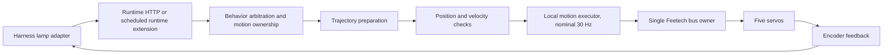
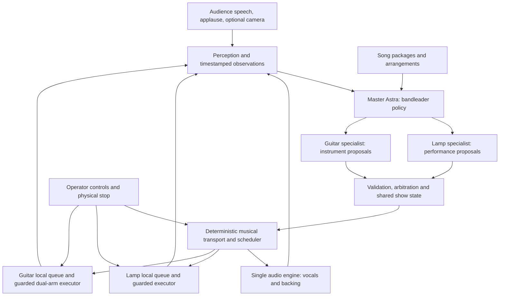
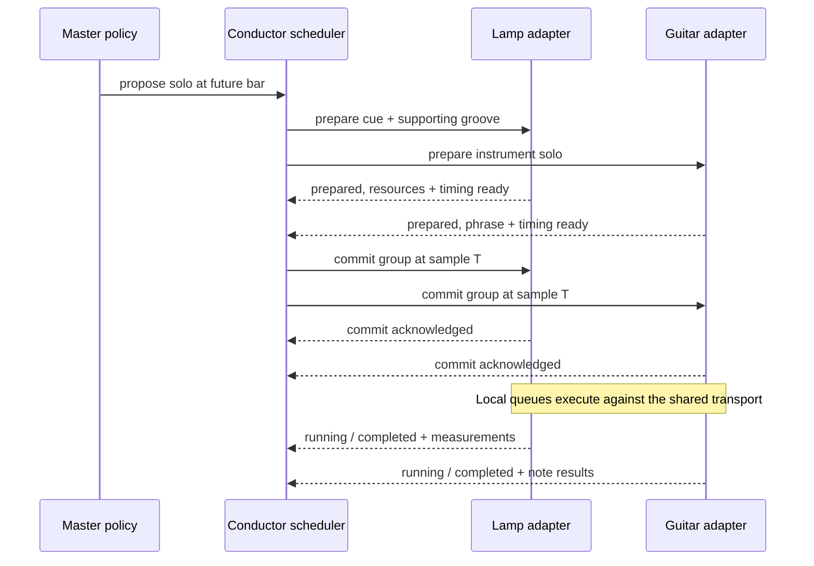

# Guitarra: lamp frontperson and robotic guitarist

Status: the five-axis composer, SDK adapter, camera recorder and supervised commissioning tools are implemented. Authenticated SDK clips have run on the physical lamp. Small yaw, waist, roll and head movements are demonstrated; elbow response remains limited and its loaded position error prevents claiming full joint health or a commissioned dance envelope. See [SDK_COMMISSIONING.md](SDK_COMMISSIONING.md). The full 40-second style A/B and audio synchronization remain unverified.

The lamp is the bandleader: it listens, introduces songs, sings through the audio system, dances, acknowledges the crowd, and gives the guitarist the spotlight. The guitar unit owns both instrument arms. A master Astra makes musical and social decisions; two specialist controllers prepare the lamp and guitar parts. **A shared musical transport and local deterministic executors provide timing.** Model response latency must never determine a strum or a beat accent.

Read [Bill's brief](BILL_BRIEF.md) for the short version. Measurement summaries are in [the trial CSV](evidence/lamp-motion-trials-2026-09-19.csv); sampled feedback is in [the telemetry JSON](evidence/lamp-motion-feedback-2026-09-19.json).

## 1. What is actually available

Evidence labels in this document:

- **Measured:** observed on the lamp through its running runtime or OS.
- **Source:** found in code/configuration; not necessarily exercised on hardware.
- **Proposed:** work still needed for the band.

### Lamp inventory

| Component | Finding | Evidence |
|---|---|---|
| Host | Raspberry Pi lamp running the LeLamp V1 Pi 5 Feetech package | Runtime reports `lelamp_v1_pi5_feetech_r1`; repository hardware definition |
| Actuators | Five STS3215 servos; existing runtime owns the serial bus | Source; live position feedback and commanded movement verified |
| Bus | Package default `/dev/lelamp`; USB serial adapter enumerates as `ttyACM0` | Source + OS enumeration |
| Interfaces | Dashboard `8080`, robot HTTP backend `8081`, camera WebSocket listener `8082` | Measured; do not assume the camera listener's protocol is a generic video stream |
| SDK | Authentication configured; capability/session/clip/action/result/cancel paths exercised | Measured; see SDK commissioning |
| Position API | Read and write through `/api/motors/positions` work | Measured, 21 completed trials |
| Lighting | 93-pixel panel in the package; runtime advertises a light controller | Source + status; no lighting trial performed |
| Microphone | Runtime reports active capture and a 16 kHz wake-word path; USB camera includes an audio device | Measured status/enumeration; audio quality and audience recognition untested |
| Direction of sound | XVF3800 ReSpeaker DOA/VAD implementation exists; expected USB device is absent from this host's enumeration | Source + measured absence; DOA unavailable/unverified for this session |
| Speaker | Selected output is `auto_null`, named **Dummy Output** | Measured; `speaker_active: true` is insufficient proof of audible output |
| Camera | Innomaker USB camera connected; snapshot retrieved | Measured; image is substantially occluded/overexposed, unsuitable for audience interpretation as positioned |
| Vision inference | `/api/perception/status` says unavailable/disabled | Measured; camera availability is separate from perception readiness |
| Conversation | Chat configured enabled but not running; conversation gate disabled | Measured |
| External view | Laptop AVFoundation camera reached; one valid 12-second existing-idle recording | Later visual session, 360 frames; no synchronized beat or new choreography trial |

There is no verified singing, speech playback, clap detector, directional audience attention, or guitar connection in this session. Those are integration tasks, not existing demo capabilities.

### Guitar reference: useful assets and boundaries

Inspected [astra-guitar at `c4283aa`](https://github.com/shaoming11/astra-guitar/tree/c4283aafe2ab0e0ae323cd6ec5ed8f89fba56b85). It contains:

- A two-SO-101 MuJoCo rig, a parameterized fret/pluck interface, scoring, and attempt recording. Its [simulation README](https://github.com/shaoming11/astra-guitar/blob/c4283aafe2ab0e0ae323cd6ec5ed8f89fba56b85/sim/README.md) explicitly identifies missing note scheduling. Simulated guitar geometry does not enforce physical guitar collisions.
- [tunefinder](https://github.com/shaoming11/astra-guitar/blob/c4283aafe2ab0e0ae323cd6ec5ed8f89fba56b85/Note%20Transcriber/README.md), producing timed monophonic note documents and single-string arrangements. Its default D-string arrangement differs from the simulator's A string.
- [Connection notes](https://github.com/shaoming11/astra-guitar/blob/c4283aafe2ab0e0ae323cd6ec5ed8f89fba56b85/CONNECT.md) describing SO-101 arms, alternative bus topologies, and an unresolved hardware bus diagnosis. The requested future hardware was described as SO-100; discover the actual model and wiring before connecting.

The [design document](https://github.com/shaoming11/astra-guitar/blob/c4283aafe2ab0e0ae323cd6ec5ed8f89fba56b85/DESIGN.md) is a useful starting proposal. Several proposed directories are absent. `sim/agent_loop.py` is a callable attempt/scoring session, not a complete deployed model-and-real-arms service. Reuse its concepts and data after verification; do not assume production readiness.

## 2. How the lamp moves

### Joint vocabulary and units

| API joint | Servo ID | Mechanical role | Performance use |
|---|---:|---|---|
| `base_yaw` | 1 | Turns the body around its base | Address audience sectors, turn toward guitar, lateral groove |
| `base_pitch` | 2 | Tilts the lower arm | Lean into a phrase, recoil, broad body pulse |
| `elbow_pitch` | 3 | Folds/extends the arm | Change silhouette and height, bow, rise into a chorus |
| `wrist_roll` | 4 | Rolls the head | Attitude, listening tilt, restrained sway |
| `wrist_pitch` | 5 | Pitches the head | Nod, look up/down, phrase accents |

These roles follow the joint model. The positive direction relative to **stage left, the audience, and the guitar** still needs external-camera calibration. There is no locomotion or direct mouth articulation.

The physical driver's coordinate mode is `normalized_m100_100`. Every joint has a calibrated range of `[-100, 100]`. These are **not degrees**, and the same numeric increment is not the same physical angle on different joints. Zero is not a neutral pose. `lelamp.json` contains calibration in raw servo counts; do not send its numbers to the normalized API.

The visualization uses a separate joint mapping with scale, offsets, and a parameter named `degrees_to_radians`. Treat it as the package's model mapping, not independent proof of physical angular accuracy. Some safety diagnostic names also say `deg/s` despite operating in normalized coordinates.

Package neutral, in joint order yaw/base pitch/elbow/roll/head pitch, is approximately `(4.4, -49.3, -22.5, 0, 30)`. The measured operating pose was substantially more folded. **Never jump to package neutral simply because it is named neutral.** Build a validated transition from the current pose and inspect it externally.

### Actual control path



The SDK research path additionally performs the package's self-collision check and, for target moves, checks final position tolerances. The dashboard position path applies range/velocity validation but does **not** call that collision checker itself. Our dashboard trials therefore validated their complete candidate paths using the same package collision model locally before sending them. That checker models head-to-base clearance, not people, cables, tables, or all possible collisions.

Do not open the serial device from a second process while the runtime owns it. Do not disable guards, alter calibration, increase torque, or retune gains to obtain more dramatic motion.

### Movement trials and what they establish

Trials used the existing HTTP runtime, small offsets around a measured pose, active torque, collision-model prechecks, and feedback sampled approximately every 100–150 ms. Idle movement was paused during trials. No end-stop search, high-speed stunt, raw bus write, gain change, or torque-release experiment was performed.

1. An initial two-command probe demonstrated that HTTP success precedes physical completion. Its prematurely sampled values are excluded from the completed-trial dataset.
2. Ten completed trials moved each joint by +4 normalized units over two seconds and returned to the trial baseline. All five coordinates were included in those targets. Measurements were taken after the requested interval plus 0.8 seconds.
3. Six trials moved yaw by +6 and returned at durations of 2.0, 1.0, and 0.5 seconds, sending only yaw targets.
4. Four alternating sway poses combined yaw ±5, roll ±3, and head pitch +2 at 1.2 seconds per transition; a final transition returned those expressive joints to their starting values.

| Joint in +4 / return trial | Error after +4 | Error after return | Interpretation within this tested pose |
|---|---:|---:|---|
| Base yaw | -0.98 | +0.67 | Useful for precise modest accents |
| Wrist roll | -0.87 | +0.42 | Useful for expressive head tilt |
| Wrist pitch | -0.60 | +2.20 | Direction/load-dependent endpoint error |
| Base pitch | -1.16 | +0.11 | Modest motion feasible; validate under other poses |
| Elbow pitch | -7.87 | -5.99 | Large load/posture-dependent error; unsuitable for an uncalibrated precise accent |

Errors are measured minus requested, in normalized units. During the full-pose trials the elbow also drifted while other joints were being exercised. These results do not isolate a mechanical cause; compliance, gravity, and controller behavior require further observation. The runtime already allows completion tolerances of 10 units for elbow, 3 for head pitch, and 2 otherwise. Those are acceptance thresholds, not promises of precision.

For the +6 yaw trials, outbound error was about -0.97 units at all three requested durations. Return error was +0.45 to +0.67. In the gesture series, HTTP acknowledgments took about **3.6–13.1 ms**. For the 0.5-second yaw moves, feedback first came within 0.3 units of the eventual endpoint at about **0.64 seconds**. This small, coarsely sampled set is not a latency distribution or a general compensation constant.

Coordinated sway completed with yaw error up to 1.09 units and roll error up to 0.81; head-pitch error reached 2.80. That establishes executable coordinated motion, **not** a visually verified natural dance. No external view was available during those 21 trials. The later camera session recorded existing idle, not a replay of those trials; it does not retroactively verify their naturalness.

After testing, the normal `idle` animation was restored and verified playing with `idle_paused: false`; torque remained enabled. Runtime source, gains, and calibration were unchanged.

### Efficient and accurate performance control

- Use sparse semantic requests such as “groove for four bars”; compile full trajectories locally. Do not send one model call or HTTP action per servo frame.
- Keep a planned pose as the baseline. Repeatedly treating a sagged encoder pose as the next commanded pose can accumulate posture drift. Feedback should verify the plan and inform bounded correction, not silently redefine it.
- Favor yaw and roll for accurate small accents. Use head pitch with measured directional tolerances. Use the elbow for slow silhouette changes after mapping its loaded behavior.
- Rehearse a small operating envelope around a chosen stage pose. The tested offsets are a starting point, not a validated whole-workspace envelope.
- Compose groove, attention, and expression into one checked joint trajectory. Separate tasks must not fight over the same servo. Specify joint masks, priorities, blend weights, and entry/exit conditions.
- Use continuous position and velocity at gesture boundaries; impose acceleration and jerk limits in the new composer. Existing linear position interpolation and velocity checks alone do not establish smooth acceleration.
- Define gestures in beats and phrases, then retime within tested speed limits. Fast songs can use half-time body motion. Increasing energy need not mean increasing joint speed: use silhouette, gaze, stillness, lights, and larger phrase contrasts.
- Measure visual accent time against audible beat time with the external camera and an audio reference. Final encoder position is not equivalent to stage presence or precise beat alignment.

Factory files include `dance`, `dance_2`, `robot_dance`, `nod`, `talking`, `curious`, and others. Their names are not sufficient to approve them: the factory `nod` spans approximately -69 to +82 in head pitch, and `robot_dance` approaches +98. Our small trials do not validate those large excursions. Use them as authoring references, then validate and rehearse bounded derivatives.

## 3. Existing API versus the interface we need

### Existing lamp interfaces

All paths below are on the robot backend, locally `http://127.0.0.1:8081`.

| Operation | Interface | Status / important semantics |
|---|---|---|
| Inspect pose | `GET /api/motors/positions` | Tested; includes normalized positions and torque state |
| Gentle dashboard target | `POST /api/motors/positions` with `positions`, `duration` seconds or `duration_ms` | Tested; asynchronous acknowledgment, no endpoint guarantee, no collision check in this route |
| Inspect playback | `GET /api/animations/status` | Tested; includes idle paused/playing; do not mistake it for a complete tracking-action lifecycle |
| Stop animation/motion | `POST /api/animations/stop` | Used in trials; verify stopped state and feedback |
| Choose idle | `POST /api/animations/idle` with `name` | Clear mapping repaired; waits for configuration result; hardware idle-off verified |
| Emergency stop | `POST /api/emergency-stop` | Source-reviewed; latches safety and disables torque; not exercised |
| Inspect SDK | `GET /api/sdk/v1/capabilities`, `/joints` | Authenticated and physically exercised |
| SDK session | `POST /api/sdk/v1/sessions` with `app_id` | Source-reviewed |
| SDK action | `POST /api/sdk/v1/actions` | `command_type`, `payload`, `idempotency_key`; session header required |
| SDK result/cancel | `GET /api/sdk/v1/actions/{id}`; `POST .../{id}/cancel` | Source-reviewed |
| Validated custom motion | Upload CSV to `POST /api/sdk/v1/clips`; call `clip.play` | Physically exercised; calibration-bound, collision-checked entry and trajectory; completion does not certify tracking |
| Media | SDK camera snapshot and multipart `streams/camera` or `streams/microphone` | Source-reviewed; metadata includes local monotonic timestamps |
| Output routing | `GET /api/audio/output-devices` | Tested; currently only Dummy Output selected |

Proposed initial SDK handshake after configuring a secret `LELAMP_SDK_TOKEN` in the runtime environment:

```text
GET /api/sdk/v1/capabilities    Authorization: Bearer <secret>
GET /api/sdk/v1/joints         Authorization: Bearer <secret>
POST /api/sdk/v1/sessions      {"app_id":"guitarra-lamp"}
POST /api/sdk/v1/actions       X-LeLamp-SDK-Session: <returned session_id>
                              Authorization: Bearer <secret>
```

Example action body, for an illustrative small target only after checking live state:

```json
{
  "command_type": "motion.move",
  "payload": {"positions": {"base_yaw": 4.0}},
  "idempotency_key": "rehearsal-001-lamp-target-001"
}
```

Read the returned action state through to its terminal result. Store the mapping from harness action ID to SDK action ID. Never put tokens in this repository or model context. SDK authentication was not changed during reconnaissance.

### SDK constraints that affect musical timing

- `motion.move` chooses its own duration. A nonzero `duration_seconds` is rejected. Its quintic target planner has a **two-second minimum**, even for a tiny move.
- `clip.play` adds an entry transition with the same minimum, **even when already at the first pose**. Consecutive clip submissions cannot be assumed to form a seamless beat grid.
- Clips are CSV: `timestamp` in seconds plus exactly the five `<joint>.pos` columns. Timestamps are rebased, strictly increasing after the first sample, and velocities checked. Source limits: 5 MiB, 18,000 frames, 600 seconds.
- The SDK checks the package collision model; clip calibration identity must still match. It does not have a public shared-transport timestamp, musical quantization, or prepared multi-device start API.
- The research motion path resumes idle after successful completion. The band needs an explicit performance ownership mode so idle/tracking cannot take over between phrases.
- Configured SDK rate limit is 30 actions/minute. This is another reason to send longer local phrases and keep status/media out of the action loop where possible.
- Existing SDK idempotency is scoped to an in-memory session/index and expires. It does not compare repeated payload hashes. The harness needs its own durable ledger and payload checks for reconnect/reboot recovery.
- `system.stop` includes torque release in the existing SDK. **It must not be used as a routine musical pause.** Torque release and a controlled hold have different physical consequences.

Two implementation stages follow from this:

1. **Lamp prototype:** activate/authenticate the existing SDK, validate one complete choreography, and explicitly account for its entry transition. Useful for posture/gesture rehearsals; no claim of tight cross-device timing yet.
2. **Band scheduler:** add a small runtime-owned scheduled-performance interface using the existing motion owner, safety filter, collision validation, and executor. It needs prepare/commit, scheduled starts, resident trajectories, feedback, cancellation, watchdog, and ownership. Do not build a competing raw serial writer to avoid these requirements.

## 4. The band harness



### Deployment and ownership

| Location | Responsibility |
|---|---|
| Show computer, initially a laptop | Song resolver, three Astra contexts, central show state, action registry, transport, audio engine, recorder, operator UI |
| Lamp Pi | Lamp adapter, motion/lighting ownership, trajectory buffer, servo executor, local fault handling, microphone/camera capture |
| Guitar host | One logical guitar unit controlling fretting and picking arms, pose table, collision/workspace constraints, note scheduling, instrument audio scoring |
| PA / audio interface | Audible vocals/backing and live guitar mix, with one primary playback clock |

Start with one show computer to minimize distributed audio problems. The physical guitar generates its own sound; the audio engine must not accidentally double its part with a backing stem. If the lamp speaker becomes usable, measure its latency before assigning it a synchronized vocal channel. Avoid Bluetooth for timing-critical playback unless measured latency/jitter meet the show requirements.

There are three policy roles, not three independent bandleaders:

- **Master Astra** resolves requests, chooses an arrangement, controls sections/tempo/key, distributes spotlight, and decides whether a crowd interaction should change the show.
- **Lamp specialist** proposes phrasing, gaze, expressive motion, lights, and delivery within the assigned musical window. It cannot independently change song time or redirect guitar motors.
- **Guitar specialist** proposes feasible riffs, accompaniment, and solo phrases within the key/time window; summarizes audio and execution quality. It owns coordination between its two arms.

Specialist proposals may be produced concurrently. The master commits one coherent plan through the scheduler. Routine perception-to-motion reactions use a bounded local reflex layer; they do not wait for three sequential cloud calls.

### Astra as the policy

Use `gpt-6-astra` with the **Responses API** for function tools. Official documentation currently requires Responses for Astra tool calling. Strict tool schemas constrain arguments, but application code still validates musical feasibility, ownership, deadlines, and safety. [OpenAI function calling](https://developers.openai.com/api/docs/guides/function-calling)

Astra accepts text and image input; its published modality table does not provide audio input/output. Feed it transcripts, audio features, measured note results, and selected camera frames. Use separate transcription, speech, and singing/audio components. Model/account access and real response latency were not tested in this session. [GPT-6 Astra model documentation](https://developers.openai.com/api/docs/models/gpt-6-astra)

Each policy observation should contain:

```text
show/session/transport epochs and observation timestamp
song, arrangement, section, bar/beat, tempo map, key and meter
current spotlight and next committed transition
queued musical horizon for each component
last action states plus actual timing and target errors
guitar playable notes/frets and active physical constraints
lamp named pose, motion headroom and current attention target
audience events with confidence, age and direction uncertainty
audio output state, microphone self-playback/AEC state, device health
optional small fresh camera frame with source and capture time
```

The master initially plans several bars ahead and replans at section boundaries or meaningful audience events. Measure cloud p95/p99 latency and size the committed horizon accordingly. Do not invent a guaranteed inference frequency. One policy timeout retains the already committed arrangement. Compact old conversation into musical state and measured outcomes; do not grow three unbounded transcripts.

## 5. Modular actions

Every action is a registry entry containing a versioned argument schema, capability requirements, resource/joint ownership, preconditions, duration bounds, entry/exit state, deadline policy, validator/compiler, executor, cancellation behavior, and result summarizer. Adding an action adds one entry and adapter implementation, not another special case throughout the orchestrator.

| Action | Typical bounded parameters | Execution / ownership |
|---|---|---|
| `band.request_song` | title, artist hint, requested style | Resolver returns a prepared package, candidate arrangements, or an explicit limitation |
| `band.start` | package ID, revision, count-in | Scheduler; both units must be ready |
| `band.give_solo` | instrument, start bar, length, energy | Master-level transaction covering guitar phrase and lamp accompaniment |
| `band.change_section` | section ID, quantization | Master only; creates a future transport/arrangement revision |
| `lamp.groove` | style preset, energy 0–1, duration in beats | Lamp composer; approved pose envelope |
| `lamp.accent` | approved accent ID, target beat, strength | Short checked gesture, scheduled with measured phase |
| `lamp.attend` | audience sector or guitar target, dwell, confidence | Attention overlay limited by stage calibration and current motion headroom |
| `lamp.say` | text/phrase asset, delivery, musical window | Speech/audio reservation; gestures follow the actual audio duration |
| `lamp.sing` | vocal asset ID, phrase region, transport offset | Audio engine plus lamp performance; no assumption that TTS can sing |
| `lamp.acknowledge` | event ID, style, intensity | Debounced reaction; won't cut off a vocal or solo |
| `guitar.play_phrase` | arrangement phrase ID, start beat, dynamics | Local guitar compiler/executor |
| `guitar.solo` | approved phrase bank, bars, key, intensity | Constrained solo assembled ahead of its start |
| `guitar.mute` | release profile | Instrument-specific stop; may require a damping mechanism |
| `show.hold` / `show.stop` | reason, boundary or immediate | Deterministic supervisor; distinct from torque release |

The model-facing function names can use underscore variants such as `band_give_solo`; the registry and protocol retain stable dotted action names. Models choose semantic targets. Raw motor commands are an operator/calibration interface, not the public band tool vocabulary.

Stage-leader example: the lamp turns toward the guitar one beat before a four-bar solo, gives a small cue, lowers its movement energy while the guitar leads, reacts to the phrase ending, then faces the audience for a shared downbeat. The guitar reports readiness and actual phrase completion; it does not need a microphone to infer the lamp's cue. The visible cue and instrument part share one committed timeline.

## 6. Proposed wire protocol: `guitarra.band.v1`

Use a reliable bidirectional WebSocket between conductor and each local adapter, with bounded queues. Use HTTP for content-addressed asset transfer and readiness/debug endpoints. Authenticate adapters; bind development endpoints to the intended private interface. Names below are **new harness messages**, not existing LeLamp routes.

### Identity, capabilities, and observation

On connection, each unit sends `hello`: unit ID, boot ID, supported protocol versions, runtime/firmware version, calibration hash, action schemas, resource map, cached asset hashes, queue capacity, media availability, and readiness/faults. The conductor assigns a show ID and session epoch. A reboot changes boot ID and invalidates old queued commands.

An observation includes source-local monotonic timestamp, sequence, age/uncertainty after clock mapping, current action, target/measured state, queue horizon, and health. Distinguish `available`, `configured`, `verified`, and `degraded`. A `speaker_active` flag with Dummy Output must never advertise verified vocal capability.

### Action envelope

The conductor creates IDs, time mappings, and deadlines after validating a model proposal:

```json
{
  "protocol": "guitarra.band.v1",
  "kind": "action.prepare",
  "show_id": "demo-001",
  "session_epoch": 3,
  "transport_epoch": 8,
  "sequence": 42,
  "action_id": "solo-003-guitar",
  "group_id": "solo-003",
  "unit": "guitar",
  "action": "guitar.solo",
  "schema_version": 1,
  "asset_sha256": "<resolved-phrase-asset-hash>",
  "calibration_id": "<expected-calibration-hash>",
  "start_sample": 1536000,
  "sample_rate_hz": 48000,
  "duration_samples": 384000,
  "musical_position": {"bar": 17, "beat": 1},
  "latest_commit_sample": 1488000,
  "resources": ["guitar.fret", "guitar.pick"],
  "late_policy": "reject",
  "args": {"phrase_id": "solo-a", "energy": 0.6}
}
```

The example values are illustrative, not a calibrated song. Asset hashes must be real content hashes before admission. Bar/beat is explanatory; `start_sample` plus the versioned tempo map is canonical. For a static tempo, beat time follows `60 / BPM`; tempo changes require integrating the tempo map. Meter changes are explicit. Nobody extrapolates a separate free-running BPM clock.

### Lifecycle and retries

```text
proposed -> validated -> prepared -> committed -> running -> succeeded
                       \-> rejected             \-> failed/cancelled
```

`prepared` means assets loaded, path checked, resources reserved, clock usable, and the queue can meet the deadline. `committed` means execution is authorized for the agreed sample; it does not mean movement has begun. Results include scheduled and actual start/end, clock uncertainty, target errors, missing notes, cancellation status, and stable reason codes.

Deduplicate by `(show_id, session_epoch, action_id)` and payload hash. Repeating the same request returns its existing state; reusing the ID with different content is rejected. Keep a bounded durable execution ledger across reconnects. A lost acknowledgment is resolved by status/reconciliation, never by creating a fresh strum ID. Device reboot or uncertain completion causes reconciliation/hold, not automatic replay. “Exactly once” physical execution cannot be inferred from a network acknowledgment.

### Coordinated prepare and commit



Use a generous start horizon and a readiness cutoff. If either unit rejects preparation, retain the prior arrangement or select a rehearsed alternative. If commit acknowledgments are missing, cancel while still outside the execution horizon and verify cancellation. If a partition occurs too late to guarantee cancellation everywhere, declare an uncertain/degraded group and let local bounded fault behavior take over. This is coordinated scheduling, not a claim of perfect atomic actuation over an unreliable network.

Late notes are dropped/replanned at a safe musical boundary; never execute a backlog as a burst. Gesture changes can move to the next permitted beat only if the action explicitly permits it. Changing a tempo/section increments transport or arrangement revision and invalidates affected future plans before recompilation.

### Time synchronization

The audio engine's presentation sample position is the show clock. Map each device's monotonic clock to the conductor clock using repeated timestamp exchanges, estimate offset and drift, and reject high-round-trip samples. Map audio samples to conductor time using audio device timestamps and measured output latency. Never compare raw monotonic timestamps from different hosts or rely solely on wall-clock timestamps.

Adapters buffer trajectories ahead and schedule locally. Start with two bars of buffering, then adjust to measured preparation and network latency. Keep longer cached continuation phrases for inference outages. Clock corrections during a phrase should slew within limits; a large discontinuity requires a hold/rearm. USB/servo delay and acoustic onset delay are separate from network clock offset.

Initial engineering targets, **not measured achievements**: clock uncertainty under 5 ms; guitar audible onset error p95 within 30 ms for the supported arrangement; lamp visual accents within 60 ms. If hardware cannot meet a target, simplify notes, lower tempo, or use broader gestures and explicitly record the attainable envelope.

## 7. Song preparation, voice, and the five-song demo

“Any song” has three distinct stages: identify what the audience means, obtain/construct a musical arrangement, and prove this guitar mechanism can execute it. Recognizing a title does not make arbitrary chords, polyphony, frets, or tempos physically playable.

### Song package

Each package should contain:

```text
manifest: song ID, aliases, artist, version, asset hashes, readiness
music: key/tuning/capo, tempo map, meter map, pickup, section boundaries
guitar: timed notes/chords, string convention, fingering/pose mapping,
        fret preparation lead time, min inter-onset, playable range
vocals: actual audio assets and sample-aligned phrase boundaries
backing: optional stems, explicit exclusion of the live guitar part
performance: style presets, gestures, gaze and spotlight cues
interaction: legal vamp/hold/solo/ending insertion points
fallbacks: simpler arrangement, guitar outage, model outage, ending
validation: hardware/calibration versions, rehearsal metrics, approval state
```

Import `tunefinder/1.0` through a translator that verifies its tuning, zero-based string convention, monophonic assumptions, range, and time origin. Transpose or simplify only as an explicit arrangement decision. A timestamped transcription still needs a physical scheduler and reachable fret transitions. Do not equate transient/onset count with the number of successfully struck strings.

The guitar adapter must advertise chord capability, reachable frets/strings, travel times, pick recovery time, maximum sustainable note rate, contact limits, and available damping. Fretting must arrive and settle before plucking. Two physical arms remain one timed instrument unit. A “solo” begins as a bank of validated phrases and transitions, not unrestricted live motor improvisation.

### Speech and singing

Spoken stage banter can be generated with a separate speech provider, rendered or buffered before its reserved window. For the polished five-song demo, singing should use prepared vocal audio with exact sample timing. A later score-conditioned singing system can implement the same asset contract after validation. Ordinary speech synthesis should not be assumed to produce controlled melody, pitch, or phrase length.

The lamp's motion follows vocal phrases: anticipatory lean, breath/rest, emphasis, release, and audience gaze. A speaker in the lamp is optional to the first show topology; a reliable shared PA can carry its voice while the body performs.

### Two request paths

- **Prepared show:** spoken title/alias resolves immediately to one of five fully rehearsed packages. Preload all assets, keep internet lookup out of the start path, and select alternate sections/solos within those packages for interaction.
- **Open request:** resolve title/artist, obtain a score/audio source through a pluggable resolver, analyze and arrange, render necessary audio, check mechanical feasibility, preview, then arm. If it cannot be made ready in time, the lamp explains the limitation and offers a simplified arrangement, short recognizable excerpt, or prepared choice. A backing-only rendition must be labeled as such.

Do not promise immediate faithful performance of every requested song on an uncharacterized two-arm mechanism. The modular design supports expansion; the demo guarantee applies to measured, prepared arrangements.

Candidate five-song set, pending team choice and guitar reachability:

| Candidate | What it exercises | Lamp direction |
|---|---|---|
| Seven Nation Army | Recognizable monophonic riff; direct link to the reference simulation | Restrained riff groove, crowd call, dramatic shared ending |
| Take Me Home, Country Roads | Country phrasing and a singalong chorus | Broad relaxed sway, audience invitation |
| Stand by Me | Steady repeated figure and a quieter dynamic | Small motion, sustained attention, phrase-end nod |
| Jolene | Faster country/folk phrasing | Tight rhythmic energy, carefully timed spotlight changes |
| Billie Jean | Pop/funk timing and repeating groove | Controlled accents and deliberate stillness |

These are proposals, not installed/playable songs. Start with 45–90-second arrangements containing an intro, recognizable hook, solo or handoff, crowd moment, and ending; expand to full songs after those work reliably.

## 8. Natural performance and audience interaction

Naturalness comes from intent, preparation, and turn-taking. The lamp should sometimes hold still to listen or let the guitar lead. Avoid continuously oscillating every joint or triggering a new random gesture on every beat.

The motion vocabulary should include `listen`, `address_audience`, `address_guitar`, `prepare_downbeat`, `groove`, `phrase_accent`, `yield_spotlight`, `support_solo`, `celebrate`, and `bow`. Each has a duration range, style parameters, allowed transitions, and physical envelope. Variation is seeded and bounded so a successful take can be replayed.

Genre presets change groove period, accent placement, motion amplitude, head/body phase, gaze dwell, and stillness. They do not need separate motor drivers. Rock may emphasize downbeats and silhouette changes; country can use gentler sway and chorus invitations; a ballad can emphasize sustained pose and partner attention. These are proposed choreography choices, not observations claimed from inaccessible videos.

### Performance reference shortlist

The reconnaissance initially reached metadata only. In the later visual session, all four references played in **Chrome** and representative paused/playback screenshots were inspected. A fifth full-body dance reference was added following the user's request for five-axis coordination. Exact timestamps and limits are in [VISUAL_FINDINGS.md](VISUAL_FINDINGS.md). These are sparse visual observations, not measured performer kinematics or audio timing.

| Reference | What to examine and translate |
|---|---|
| [The White Stripes — Jolene, official live video](https://www.youtube.com/watch?v=yXlULkwhgrc) | Dynamics in a minimal rock duo; when larger motion is earned by a phrase |
| [Chris Stapleton / Justin Timberlake — CMA 2015](https://www.youtube.com/watch?v=3Nl2rdaddKw) | Country/soul vocal handoffs, partner cues, audience acknowledgment |
| [The Civil Wars — NPR Tiny Desk](https://www.youtube.com/watch?v=HamYmjllE6A) | Singer/guitarist interaction, gaze, breaths, and restrained expression |
| [Rodrigo y Gabriela — NPR Tiny Desk Home Concert](https://www.youtube.com/watch?v=PMpGjox3TBs) | Rhythmic lead/support roles and phrase-level interaction |

For actual review, annotate cue → partner response → musical boundary → audience response. Extract movement principles, not exact human joint trajectories. Use the external lamp view to compare whether a translated gesture reads clearly.

### Audience observations

Normalize sensors into events such as:

```json
{
  "type": "audience.applause",
  "event_id": "aud-104",
  "capture_mono_ns": 1000000000,
  "source_unit": "lamp",
  "confidence": 0.88,
  "duration_ms": 1400,
  "direction": null,
  "playback_active": true,
  "self_audio_rejected": false
}
```

This is an example schema, not a measured clap. Preserve uncertainty rather than inventing direction. Microphone array azimuth must be calibrated into the stage frame, including whether the array is base-fixed or head-mounted; account for pose when appropriate. Clamp attention targets to the rehearsed envelope.

Audio pipeline: capture → playback-reference echo cancellation where supported → voice/activity and music/crowd discrimination → transcript/clap/cheer features → event debouncing → policy observation. Guitar transients, the lamp's own singing, and servo noise can all resemble audience signals. Use the actual playback reference, a guitar pickup/reference where possible, listening windows, and direction confidence. VAD alone is not an applause classifier.

Bounded fast reactions can produce a subtle glance or nod after a reliable event. The master decides semantic consequences, such as acknowledging applause at a phrase end, inviting a clap pattern, or extending a vamp. Apply cooldowns, minimum dwell, and a maximum interruption rate. Missing sensors disable the relevant behavior rather than generating pretend observations.

Optional camera modules emit timestamped person/hand/wave events and stage-relative sectors. Reject stale frames. The attached camera's present image and disabled perception are insufficient for these capabilities; the laptop view can first serve as a rehearsal camera without enabling autonomous crowd tracking.

## 9. Reliability and failure behavior

Show states: `IDLE → LISTENING → PREPARING → ARMED → COUNT_IN → PERFORMING → ENDING → IDLE`, plus `HOLD`, `DEGRADED`, and latched `FAULT`. A solo is a musical section within performance. Only the deterministic supervisor transitions into armed/running states after readiness checks.

| Condition | Required response |
|---|---|
| Model slow/unavailable | Continue the committed cached phrase/arrangement; skip optional banter; no servo starvation |
| Specialist proposals disagree | Master/conductor retains previous committed state; reject incompatible proposals |
| One unit not prepared | Do not start the group; choose an explicit rehearsed fallback |
| Network loss | Local heartbeat watchdog and bounded queue horizon; finish only the allowed short segment, then controlled hold |
| Reconnect/reboot | Reconcile boot/session/transport epochs and ledger; discard stale commands; explicit rearm |
| Late note/expired cue | Drop/reject or use the action's defined future boundary; never compress missed movements |
| Excess position error/stall | Cancel the affected plan, maintain a validated hold if mechanically appropriate, report fault; no blind repeated stronger move |
| Audible output unavailable | Refuse a vocal show-ready state; offer an explicitly selected instrumental/silent rehearsal |
| Crowd detection uncertain | Preserve musical flow; omit the reaction |
| Guitar cannot play request | Return a capability explanation and feasible arrangement options |
| Clock uncertainty too large | Stop committing tight synchronized parts; hold/rearm or use a declared degraded mode |
| Physical emergency | Independent stop path; no cloud dependency; recovery requires inspection and explicit rearm |

Proposed heartbeat period is 250 ms with a one-second loss threshold, to be tuned on the actual network. A stopped position queue still leaves servo torque holding; a process crash is not a physical stop. A bus/power fault may prevent a commanded hold. The operator needs a physical power/stop method and clear distinction between pause, controlled stop, torque release, and emergency stop. Do not assume releasing torque is safe for a gravity-loaded lamp or arm.

Keep the tested lamp protections and add a narrower performance envelope, fault thresholds with dwell, resource arbitration, and bounded queues. Monitor temperature/current/load if reliably available; those telemetry signals were not read in this session. No safety claim should depend on a sensor that is absent.

Record show and action IDs, model requests/results and latency, sensor summaries, clock estimates, queued horizon, scheduled/actual starts, measured positions, guitar pitch/onset scores, audio underruns, faults, and operator intervention. Capture external rehearsal video when available. Keep secrets and unnecessary audience recordings out of repository artifacts.

## 10. Proposed repository layout

```text
guitarra/
  ARCHITECTURE.md
  BILL_BRIEF.md
  evidence/                   # this reconnaissance's motion measurements
  band/                       # partial implementation; other areas remain proposed
    protocol/                 # schemas, versioning, IDs, clock mapping
    conductor/                # show state, scheduler, transactions, watchdog
    policies/                 # master/lamp/guitar Astra contexts
    actions/                  # registry, schemas, validators, compilers
    adapters/
      lamp/                   # implemented SDK lifecycle client; scheduling remains proposed
      guitar/                 # one unit, two arms, physical calibration
      simulated/              # identical protocol for hardware-free work
    perception/               # audience events, transcript, DOA, optional vision
    audio/                    # transport, vocals, backing, routing/reference
    songs/                    # manifests and content-addressed prepared assets
    performance/              # implemented candidate gestures, styles and composition
    rehearsal/                # implemented compile/capture/supervised-execution tools
    recording/                # event logs and deterministic replay
    operator/                 # readiness, selection, hold, stop, fault display
  tests/                      # meaningful timing, retry, fault and schema tests
```

Keep the existing runtime in its own repository. Implement a minimal reviewed extension there only for capabilities that cannot be provided through its current public API. Package/commit hashes become part of run provenance.

## 11. Build order and acceptance gates

Reconnaissance completed step 1. Camera access and software candidates now cover
parts of steps 2–4, but no later physical acceptance gate is complete. The narrow
rehearsal candidate is 40 seconds with simulated guitar/audience cues; singing,
shared audio transport, exclusive ownership and physical improvement remain unverified.

| Stage | Concrete deliverable | Gate before moving on |
|---|---|---|
| 1 — completed exploration | Source map, 21 completed physical trials, telemetry, architecture and brief | Be explicit about untested visual/audio/guitar behavior |
| 2 — lamp commissioning | Reachable external camera, real audio route, SDK token, chosen stage pose, small gesture library, correct DOA device if required | Human-visible smooth moves and audible voice; direction labels verified; stop/hold behavior rehearsed |
| 3 — deterministic harness | Fake guitar + real lamp adapter, transport, prepare/commit, ownership, logging and fault injection | Scheduled execution without model involvement; replay, duplicate delivery, reconnect and stale-action tests |
| 4 — one band scene | One prepared 45–90-second song scene, lamp vocals/motion, simulated guitar, solo handoff and crowd moment | Ten consecutive clean runs; verify audiovisual timing with recording |
| 5 — real guitar integration | Verified model/wiring/tuning, calibrated poses, playable-note envelope, local scheduler and audio scorer | Fret settles before pick; repeatable correct notes and measured onset timing |
| 6 — five polished packages | Team-selected song set, spoken aliases, independent recovery/fallback for each | Random-order requests, noisy room, crowd events, model outage, and repeated full performances |
| 7 — open repertoire | Resolver → transcription/score → feasible arrangement → audio rendering → validation | Honest preparation time and fallback behavior for unseen requests |

Useful demo gates: no unintended replay from duplicate messages; no stale commands after reboot; bounded stop response without cloud access; no queue underruns in repeated show-length runs; song recognition under background audio; no false crowd feedback loop from the band itself. Timing targets in section 6 are provisional until measured. A ten-run gate helps engineering, but is not proof of general production reliability.

### Decisions for the next conversation

1. Which five songs, versions, and excerpt lengths should we perfect?
2. The laptop camera is accessible; where are audience and guitar relative to the lamp, and when is exclusive motion/service control available for A/B trials?
3. Which physical speaker/PA and microphone array are available? Is a reliable shared PA acceptable for the lamp's voice?
4. For the first build, choose the lamp commissioning + gesture harness; then bring in the guitar through the same protocol.
5. Confirm the guitar's actual SO-100/SO-101 models, arm wiring, tuning, and intended fretting/picking mechanism when hardware becomes accessible.

## 12. Engineering source map

Lamp source inspected at commit `fe874862b1ceaf151a6b37b184ab5ec12e09e6cd` in `/home/lelamp/lelamp-hackathon-2026`:

| Area | Files relative to that runtime checkout |
|---|---|
| Robot contract | `static/robots/lelamp_v1/pi5_feetech_r1/{robot,actuation,safety,kinematics,poses}.yaml` |
| Hardware calibration/driver | `lelamp.json`; `modules/robot_base/robots/actuation/calibration.py`; `modules/robot_base/robots/backends/feetech/driver.py` |
| Dashboard control | `apps/robot_runtime/web/routes/motion.py`; `apps/robot_runtime/web/legacy_routes/animations.py` |
| SDK resources and actions | `apps/robot_runtime/web/routes/sdk.py`, `sdk_research.py`; `modules/support/sdk_gateway/{service,research,policy,domain,mapper}.py` |
| Timing and protection | `modules/robot_base/control/{runtime,executor,safe_motion,safety_filter}.py` |
| Arbitration | `modules/robot_base/behavior/{runtime,motion_manager,motion_policy}.py` |
| Media | `modules/support/sdk_gateway/media.py`; `modules/robot_base/audio/localization/respeaker.py`; `apps/robot_runtime/web/routes/audio_outputs.py` |

Local exploratory scripts and the excluded initial probe log remain under `/tmp/lamp-recon`; they are investigation tools, not a supported production controller. Committed telemetry contains no camera images, microphone audio, credentials, or unrelated host logs.
