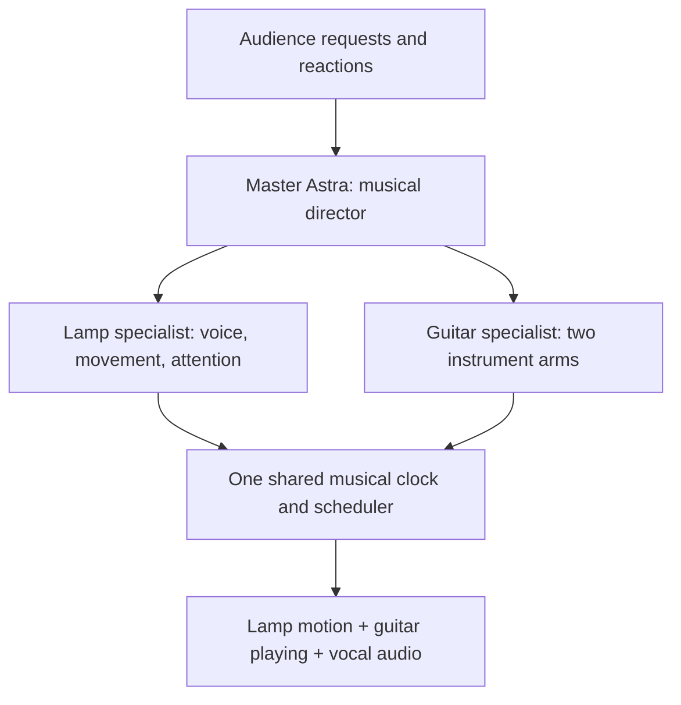

# Bill: the robot band in two minutes

**The lamp is the frontperson. The guitar is its bandmate.** The lamp takes requests, talks to the crowd, sings through the audio system, dances, introduces solos, and visibly reacts to the guitarist. The guitarist plays accompaniment and takes the spotlight when invited.

First perfect five prepared songs that judges can request in any order. Unfamiliar songs need an arrangement the mechanism can play, prepared vocals, and validation before performance.

## How it works

Astra decides **what happens next**. Local controllers execute **when and how it happens**. Preparing phrases ahead keeps cloud response time off the beat. Both robots share one song timeline.

New abilities become registered actions: `groove`, `look_at_guitar`, `say`, `sing_phrase`, `give_solo`, and `bow`. Each declares its timing, requirements, and limits.

## What we learned by moving the lamp

- Five axes: base turn, lower-arm tilt, elbow, head roll, and head pitch. Commands use **-100 to 100 values, not degrees**.
- **21 physical trials** covered every axis, three yaw speeds, and coordinated sway. Yaw/roll were promising for precise accents. The loaded elbow missed targets by roughly 6–8 units in this pose.
- Dashboard “OK” arrives before movement finishes. The new SDK adapter waits for terminal execution results; physical tracking and synchronized starts still need measurement.
- Normal idle was restored after the earlier trials. A later laptop-camera recording captured existing idle, but the new choreography has not run on hardware.

## What needs fixing before a show

The lamp selects **Dummy Output**; audible singing is not ready. The directional microphone array was not detected. Its camera view is obstructed and vision inference disabled. SDK authentication is configured and checked clips now run.

The guitar reference provides simulation/transcription work; real arms and note timing remain unverified. We currently have only lamp access.

Use prepared singing audio and separately generated banter. A reliable PA carries vocals/backing alongside the actual live guitar.

## What makes them feel like a band

The lamp cues a solo, faces the guitar, gives it space, celebrates its final phrase, then leads a shared downbeat. Crowd reactions happen at musical boundaries. Stillness and anticipation matter as much as dancing.

Four duet references and a full-body dance reference were played in Chrome and
sampled visually. The candidate maps dance across all five axes: turn, waist
pulse, opposing elbow motion, roll and smaller head accents. Two 40-second styles
and controlled phase/support comparisons compile, with 33 regression checks
passing. This is implemented software, not a physically verified dance improvement.

## Recommended next step

**Resolve the elbow response before increasing dance range.** The SDK is working,
and supervised small-motion probes have been physically executed with an external
camera. The loaded elbow still misses its planned posture. Audio remains Dummy
Output. Both 40-second styles and controlled naturalness comparisons remain to
be physically accepted; do not equate SDK clip completion with joint health. Physical results and exact replay commands are tracked in
[VISUAL_FINDINGS.md](VISUAL_FINDINGS.md) and [REHEARSAL.md](REHEARSAL.md).

Candidates: *Seven Nation Army*, *Country Roads*, *Stand by Me*, *Jolene*, and *Billie Jean*. Song/version choices are pending; none is ready yet.

Full protocol, measurements, source references, failure behavior, and build gates: [ARCHITECTURE.md](ARCHITECTURE.md).
